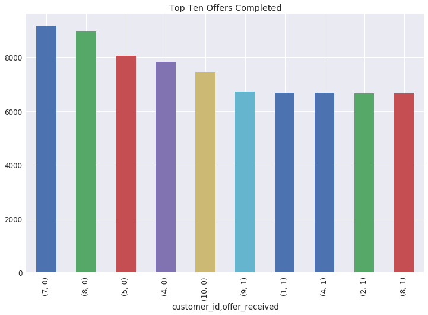
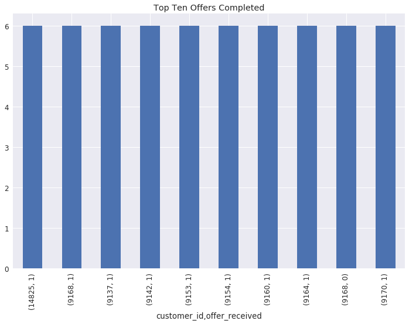
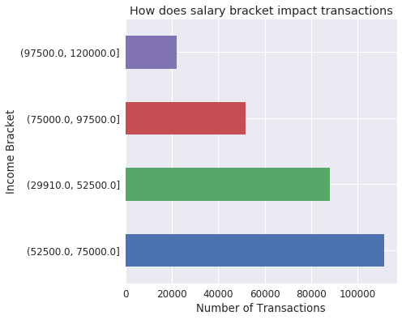
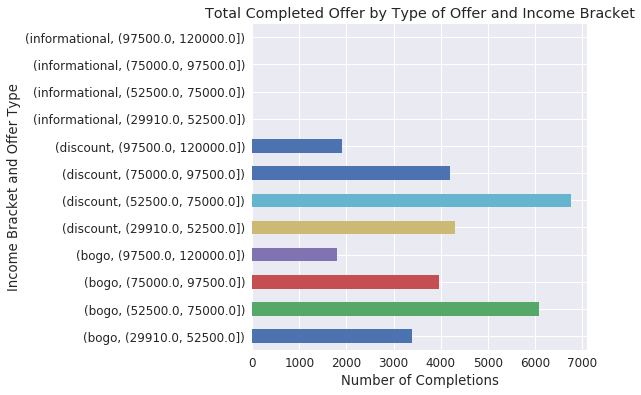
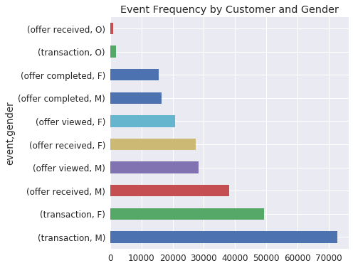

# Udacity Capstone Project

## Project Overview

For the final capstone, Starbucks offer synthetic data to be analysed for useful insights. As such, we were given free rein on the direction we wanted to take, and I decided to focus on the general data cleaning process, and how well one can work with such data.

## Problem Statement
There were a few questions I set answer through this project.
1. In data engineering, just how much engineering do you need, and when should you stop?
2. Do you really spend more when you earn more?
3. How does gender affect spending?
4. Is sythetic data reliable for simulations and predictions?
5. With this data, how accurately can you predict whether a customer will complete their offer or not?

## Metrics
Wihile there is a huge focus on the aggregations and resulting visuals, in the predictive model I created, the metrics used are:
-- chi-square in the feature selection process 
-- Confusion matrix, providing the precision, recall, and f1-score of the model's performance.
-- Accuracy of the overall predictions.

## Data Cleaning and Exploration
In looking at the data, 3 different data sets were provided:

* portfolio.json
* profile.json
* transcript.json 

And while for the most part they didn't pose a problem, in the transcript data, the value variable which contained dictionaries as the values had significant inconsistencies. The `offer id` was present in two forms `offer_id` and `offer id`, which in a dataset of over 340,000 rows, poses a problem when trying to access each dictionary's value.

I observed that there were `17,000`customers in the simulated data

Another observation made was on the sparseness of the `offer_completed` varible. 

## Using Data Visualization to Answer Prolem Statement

### 1. In data engineering, just how much engineering do you need, and when should you stop?

-- The plots above and below weer generated from the same lines of code.

          ` summary = df.groupby(['customer_id',
                                'offer_received'])['offer_completed'].count().sort_values(ascending=False).head(10)
          summary.plot.bar(figsize=(12,8));
          plt.title('Top Ten Offers Completed'); `

But the difference is that the one below resulted from too much engineering. I along with the `event`column which I transformed to 4 binary variables, I did the same with the `offer_type`, `value` and `channels` variables which resulted in a distorted data frame.

So yes! There is such a thing as too much data engineering/wrangling/manipulation. It's important to ve cautious and deligent with the process.

### 2. Do you really spend more when you earn more?

**Spending vs. Income | Offer vs. Income**
:-----------------|-----------------------:
 |             

Based on the side by side plots above, which shows the number of transactions per income bracket, it is clear that people in lower income brackets spend more (at least in Starbucks), especially when they are offered by-one-get-one (BOGO) or discount deals.

### 3. How does gender affect spending?

Interestingly, based on the figure above which shows the event frequency by gender, it would seem like men really love their Starbucks coffee. This aids for good trageted marketing, and I would think that further assessing based on age would tell more.

### 4. Is sythetic data reliable for simulations and predictions?

Based on all the visulization, I would say Yes. As long as the synthetic data is very similar to real data, there's alot that can be learnd from it. 

## Modeling
To create the model, I utilized the `OrdinalEncoder` and `LabelEncoder` provided in the sklearn library to encode all the variables, use case below.

                          ` # split and prepare the dataset
                            def split_data(df=df):
                                X = df.loc[:, df.columns != 'class'].astype(str)
                                del X['offer_completed']
                                y = df['class']
                                X = X.astype(str)
                                oe = OrEncoder()
                                oe.fit(X)
                                X= oe.transform(X)
                                le = LabelEncoder()
                                le.fit(y)
                                y = le.transform(y)
                                return X, y`
                                

In building the machine learning pipeline, I combined the SelectKbest and RFE feature selectors, and a Random Forest classifier. 

                              `def feature_sel(X, y, classifier, score_func = chi2, n=5, k='all', step=1):
                                  # set feature selector
                                  selector1 = RFE(classifier, n, step)
                                  selector2 = SelectKBest(score_func,k)
                                  # combine features
                                  combined_features = FeatureUnion([("rfe", selector1), 
                                                                    ("Kbest", selector2)])  
                                  # Use combined features to transform dataset and get features
                                  X_features = combined_features.fit(X, y).transform(X) 
                                  return combined_features, X_features
                              `

The initial transfor was done with the parameters`k` set to `all` and `n` set to `5`. After the transformation, I then grid search cross-validation to determine the best parameters, which was `k = 10` and `n = 12`, with which I tuned the pipline, trained the final model, and tested it. 

## Results

Offer Completed | precision |  recall  | f1-score |  support
------------|---------|----------|----------|----------
 0 |   0.98  |   0.88   |   0.93   |  9560
 1 |   0.96  |   1.00   |   0.98   |  30543
------------|---------|----------|----------|----------
accuracy |         |         |   0.97   |  40103
macro avg |   0.97  |   0.94   |   0.95   |  40103
weighted avg |   0.97  |   0.97   |   0.97   |  40103

**confusion matrix**

Offer completed |  0   |  1
----------------|------|-----
0 | 8395 | 1165
1 | 146  | 30397

`Accuracy: 0.97`

### 5. With this data, how accurately can you predict whether a customer will complete their offer or not?
The model has an accuracy of 97% which means that 97 out of 100 predictions will be correct, and with an f1 score of 0.96, it shows that the model will perform well on independent data

## Conclusion
The data contains useful insights to consumerism, and it will be interesting to see how the model performs on independent data.
